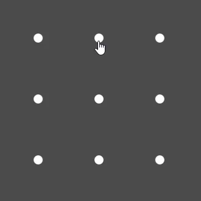
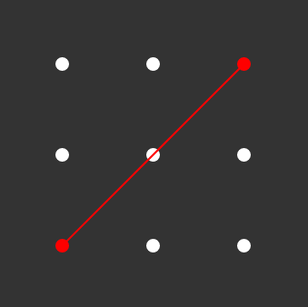
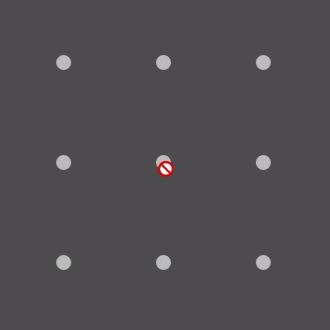
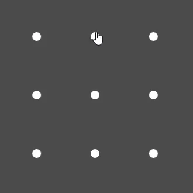
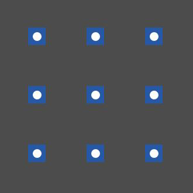

# React-Pattern-Lock
### Android's pattern lock
* Supports multiple sizes. eg : 2x2, 3x3, 4x4 -- 15x15.
* Supports touch screens.
* Many options to customize the input.

[](https://codesandbox.io/s/n5j7knjo54)

## Installation
```npm install react-pattern-lock```
## How to use

```javascript
import React, { Component } from "react";
import PatternLock          from "react-pattern-lock";

// in you render method
<PatternLock
	width={ 300 }
	pointSize={ 15 }
	size={ 3 }
	onChange={ (pattern) => {
		return new Promise((resolve, reject) => {
			setTimeout(() => pattern.join("") === "1340" ? resolve() : reject(), 1500);
		});
	}}
/>
```

### Props
| Prop | Type | Default | Definition |
| --- | --- | --- | --- |
| [size](#prop-size) | Number | 3 | The size of the pattern input. |
| width | Number, String | "100%" | The width of the pattern wrapper. |
| [disabled](#prop-disabled) | Boolean | false | Disables the pattern input. |
| [invisible](#prop-invisible) | Boolean | false | Makes the lines that connect the points invisible. |
| [noPop](#prop-noPop) | Boolean | false | Disables the pop animation when a point gets activated. |
| onChange | Function | (path: number[]) => void | A Function (the first argument is the drawn path). |
| path | number[] | [] | The drawn path. |
| [allowJumping](#prop-allowJumping) | Boolean | false | Setting this to true would disable the auto activation on points that are in the middle of 2 already activated points (see details below). |
| allowOverlapping | Boolean | false | Allows you to select the same point multiple times (Doesn't show the pop animation on the second time). |
| pointSize | Number | 10 | The size of the pattern points (used for width and height) in pixels. |
| [pointActiveSize](#prop-pointActiveSize) | Number | 30 | The size (in pixels) of the active area of the pattern points. |
| connectorThickness | Number | 2 | The thickness (in pixels) of the lines that connect the points. |
| connectorRoundedCorners | Boolean | false | Setting this to true makes the connector edges rounded. |
| className | String | "" | Any css classes that you might want to send to the wrapper. |
| success | Boolean | false | Will add "success" class to the wrapper, it will also make the points and the connectors green |
| error | Boolean | false | Will add "error" class to the wrapper, it will also make the points and the connectors red |
| style | Object | {} | Any css styles that you might want to send to the wrapper. |

----
### <a name="pattern-representation"></a> Pattern Representation

A pattern path is represented as an array of numbers.
for example :  
in a 3x3 pattern
the points are numbered starting from 0 top left, and ending in 8 bottom right.


So for example :



This would result in an array like this ```[1, 3, 4, 0]```.

----

### Detailed Props

#### <a name="prop-size"></a> size ```Number``` *default : 3*
The size of the pattern input
* 3 is 3x3 (9 points in total).
* 4 is 4x4 (16 points in total).
* etc.

#### <a name="prop-allowJumping"></a> allowJumping ```Boolean``` *default : false*
Setting this property to true would allow you to connect 2 points that have unselected points between them (diagonally, vertically or horizontally) without the points in the middle being auto selected for you (see image below).



#### <a name="prop-disabled"></a> disabled ```Boolean``` *default : false*
Makes the pattern input disabled (turns gray and user input is disabled).



#### <a name="prop-invisible"></a> invisible ```Boolean``` *default : false*
Hides the lines that connect the pattern points.


#### <a name="prop-noPop"></a> noPop ```Boolean``` *default : false*
Disables the pop animation when a point gets activated.



#### <a name="prop-pointActiveSize"></a> pointActiveSize ```Number``` *default : 30*

The active area of each of the points.  
When the cursor enters this area the point will be activated.

Activate areas are indicated by the blue squares.



## Extra
You can override the default colors for (disabled, success, error) using css
Check the codepen example for more info

[](https://codesandbox.io/s/n5j7knjo54)

# License
MIT Licensed. Copyright (c) WinterCore 2019.